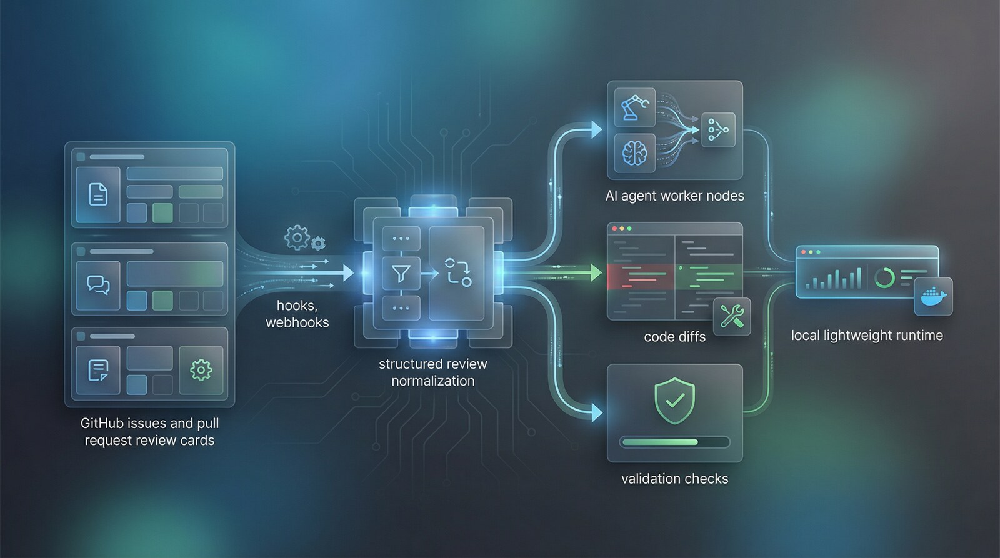

# software-factory

[](https://github.com/sun-praise/software-factory/actions/workflows/pytest.yml)
[](https://github.com/sun-praise/software-factory/actions/workflows/opencode-review.yml)


English | [简体中文](README.zh-CN.md)



`software-factory` is a lightweight FastAPI-based issue/PR-driven autonomous development system.

It focuses on turning issue intake, PR review feedback, autofix execution, and write-back into a traceable, extensible, locally runnable loop.

This project is intended for local development and validation only. Many security checks and deployment hardening steps are still incomplete, so it should not be exposed directly to production or untrusted networks.

The core idea is simple: issues, hooks, and GitHub webhooks decide when work should start; the agent worker executes the change flow; and the web UI only exposes the operational state that matters.

## Overview and Goals

In a typical review workflow, the repetitive loop is often:

"read comments -> summarize issues -> ask AI to fix them again".

This project aims to standardize that loop into an automated closed system:

- Accept manual issues and operator-provided issue-like inputs as human-triggered entrypoints
- Use hooks to record managed development sessions as deterministic triggers
- Use GitHub webhooks to detect issue, PR review, and comment changes
- Use a review normalizer to convert raw feedback into structured autofix tasks
- Use an agent worker to run fixes, checks, commits, pushes, and PR write-back
- Use a thin web layer to visualize recent runs, states, and failures

Non-goals:

- A heavy multi-tenant backend platform
- A full approval or permission center

## Positioning

This project is not trying to become a general CI/CD platform, and it does not aim to cover the full DevOps lifecycle. A more accurate description is:

- `Issue/PR-driven Autonomous Development System`
- `AI-native GitHub Issue & PR Orchestrator`

Its scope is specifically:

- Issues, hooks, and webhooks decide when execution should start
- The normalizer turns issue/review/comment input into structured fix instructions
- The agent worker performs code changes, verification, commits, pushes, and GitHub write-back

Compared with familiar open-source systems, it is closer to:

- `OpenHands` or `SWE-agent` style AI execution agents
- `Prow` or `Zuul` style event-driven review / CI orchestration systems

And not to broader DevOps products such as `Harness` or `GitLab`.

## Architecture

```text
Hook (Claude Code lifecycle)
  -> Local Orchestrator API
    -> State Store / Queue
      -> GitHub Webhook Adapter
      -> Review Normalizer
      -> Agent Worker
      -> Thin Web
```

Main responsibilities:

- Hook: reports managed-session events without making semantic decisions
- Webhook adapter: ingests GitHub events, validates signatures, and deduplicates raw events
- Normalizer: converts issue, review, and comment input into structured autofix work items
- Agent worker: checks out code, applies fixes, runs validation, and writes results back
- Thin web: shows runs, statuses, and error summaries

## Current Progress

Milestone overview:

- M1 (done): minimal runnable skeleton
  - FastAPI service, health check, SSR pages
  - Placeholder `/hook-events` and `/github/webhook` endpoints
  - SQLite initialization script and core schema
  - Base CI (`OpenCode Review` + `Pytest`)
- M2 (done): event persistence, idempotency, and session association
  - Structured parsing and storage for hook / GitHub events
  - Dedup keys, error handling, and status transitions
  - Session-to-PR association mapping
- M3 (done): full GitHub webhook integration
  - Signature verification and debounce handling
  - `pull_request_review`, `pull_request_review_comment`, and `issue_comment` support
- M4 (done): review normalizer
  - Normalize review/comment input into structured autofix tasks
  - Deduplication, severity classification (`P0-P3`), and noise filtering
- M5 (done): agent worker execution path
  - Git checkout / commit / push
  - Check command execution (`lint` / `test`)
  - PR comment write-back
- M6 (done): reliability hardening
  - Idempotency-key deduplication to avoid duplicate runs
  - PR locking to avoid concurrent conflicts
  - Exponential backoff retries
  - Autofix attempt limit per PR (`MAX_AUTOFIX_PER_PR`)
  - Bot / noise comment filtering
  - Log archival and retention
- M7 (in progress): documentation and test completion
  - System architecture docs
  - Troubleshooting guide
  - E2E integration tests
  - Stress testing

Anything not explicitly described here should be treated as out of scope for the current project stage.

## Install

Before you run it:

- Treat the repository as a local-only development environment
- Many security checks are still incomplete, including broader auth, input validation, permission control, and deployment hardening
- Do not use it as a production service or expose it to public networks before a dedicated security review

1. Create a Python 3.11 virtual environment and install dependencies.

```bash
python3 -m venv .venv
source .venv/bin/activate
pip install -U pip
pip install -r requirements.txt
```

2. Create local environment config.

```bash
cp example.env .env
```

3. Set one shared `DB_PATH` for every local process. See [docs/local-runtime.md](docs/local-runtime.md) for the rule and failure mode.

```bash
export DB_PATH="$(pwd)/data/software_factory.db"
```

4. Initialize the database.

```bash
python scripts/init_db.py
```

5. Start the app.

```bash
env DB_PATH="$DB_PATH" uvicorn app.main:app --host 127.0.0.1 --port 8001 --reload
```

6. Optionally start the worker with the same `DB_PATH`.

```bash
env DB_PATH="$DB_PATH" python scripts/run_worker.py --loop --workspace-dir "$(pwd)"
```

### LLM-Friendly Install Prompt

Copy this into Codex / Claude / OpenCode when you want an agent to install and verify the project locally. The detailed install steps now live in [docs/agent-install.md](docs/agent-install.md). Repository: `https://github.com/sun-praise/software-factory`

```text
Install and verify the GitHub repository https://github.com/sun-praise/software-factory locally.
If the repository is not already open, clone or open it first.
Then work from the repository root and follow docs/agent-install.md and docs/local-runtime.md exactly.
Do not modify application code just to make local setup pass.
If something fails, report the exact failing command, the root cause, and the smallest fix.
```

## Local Run

See [docs/local-runtime.md](docs/local-runtime.md) for local runtime details and `DB_PATH` constraints.

Local runtime warning:

- Run the stack only in a local environment you control
- Security testing and hardening are not complete yet
- Avoid direct exposure to production traffic, public ingress, or untrusted users

1. Create a virtual environment and install dependencies.

```bash
python3 -m venv .venv
source .venv/bin/activate
pip install -U pip
pip install -r requirements.txt
```

Runtime requirements:

- Python 3.11+
- SQLite 3.35+ (`autofix_runs` queue claiming uses `RETURNING`; older versions automatically fall back to a compatibility path)

2. Configure environment variables.

```bash
cp example.env .env
```

Edit `.env` as needed. Values in parentheses are defaults:

Base settings:

- `APP_ENV` (`development`): runtime environment label
- `HOST` (`127.0.0.1`): bind address
- `PORT` (`8000`): listen port
- `DB_PATH` (`./data/software_factory.db`): SQLite file path
- `GITHUB_WEBHOOK_SECRET` (empty): can be left empty for local debugging; production should enable signature verification
- `GITEE_WEBHOOK_SECRET` (empty): used when `WEBHOOK_PROVIDER=gitee`
- `GITHUB_TOKEN` (empty): GitHub API token for PR metadata, comments, and webhook enrichment
- `GITEE_TOKEN` (empty): Gitee API token for PR metadata, comments, and webhook enrichment
- `FORGE_PROVIDER` (`github`): forge provider, set to `gitee` to create/comment/query PRs on Gitee
- `TASK_SOURCE_PROVIDER` (`github`): task-source provider, set to `gitee` to resolve Gitee task URLs
- `WEBHOOK_PROVIDER` (`github`): webhook provider, set to `gitee` for Gitee webhook headers/signatures
- `GIT_REMOTE_PROVIDER` (`github`): remote URL provider, set to `gitee` for clone and PR links

Webhook settings:

- `GITHUB_WEBHOOK_DEBOUNCE_SECONDS` (`60`): debounce window in seconds

Reliability settings (M6):

- `MAX_AUTOFIX_PER_PR` (`3`): max autofix attempts per PR
- `MAX_CONCURRENT_RUNS` (`3`): max concurrent runs
- `PR_LOCK_TTL_SECONDS` (`900`): PR lock TTL in seconds
- `MAX_RETRY_ATTEMPTS` (`3`): max retry attempts
- `RETRY_BACKOFF_BASE_SECONDS` (`30`): base retry delay
- `RETRY_BACKOFF_MAX_SECONDS` (`1800`): max retry delay

Filtering settings (M6):

- `BOT_LOGINS` (empty): comma-separated bot accounts, for example `github-actions[bot],dependabot[bot]`
- `NOISE_COMMENT_PATTERNS` (empty): comma-separated noise comment regex patterns, for example `^/retest\b,^/resolve\b`
- `MANAGED_REPO_PREFIXES` (empty): comma-separated managed repo prefixes, for example `acme/,widgets/`
- `AUTOFIX_COMMENT_AUTHOR` (`software-factory[bot]`): autofix comment author label

Logging settings (M6):

- `LOG_DIR` (`logs`): log directory
- `LOG_ARCHIVE_SUBDIR` (`archive`): log archive subdirectory
- `LOG_RETENTION_DAYS` (`7`): log retention days
- `WORKER_ID` (`worker-default`): worker identifier

Agent runner settings:

- The Settings page now supports three runner modes: `Ralph`, `Claude Agent SDK`, and `OpenHands`
- `RALPH_COMMAND` (default `ralph`): optional env override for the Ralph CLI command used by the worker
- `RALPH_COMMAND_TIMEOUT_SECONDS` (default `1800`): optional env override for Ralph execution timeout
- The worker host must have a usable `ralph` executable in `PATH` if Ralph mode is enabled or selected as primary

3. Initialize the SQLite database.

```bash
python scripts/init_db.py
```

This creates four core tables: `sessions`, `pull_requests`, `review_events`, and `autofix_runs`.

4. Start the web service.

```bash
uvicorn app.main:app --host 127.0.0.1 --port 8001 --reload
```

5. Or start both `web` and `worker` in the background.

```bash
chmod +x scripts/start_system_bg.sh
./scripts/start_system_bg.sh start
```

Common management commands:

```bash
./scripts/start_system_bg.sh status
./scripts/start_system_bg.sh logs
./scripts/start_system_bg.sh stop
```

Notes:

- The script loads `.env` from the repository root first
- `web` and `worker` are forced to share the same `DB_PATH`
- PID files and logs default to `.runtime/local/`

## Development and Debug Commands

Health check:

```bash
curl -i http://127.0.0.1:8001/healthz
```

Simulate a hook event (`/hook-events`):

```bash
curl -i -X POST http://127.0.0.1:8001/hook-events \
  -H 'content-type: application/json' \
  -d '{"event":"UserPromptSubmit","session_id":"sess_demo","repo":"owner/repo","branch":"feat/demo","cwd":"/tmp/software-factory","timestamp":"2026-03-12T12:00:00Z"}'
```

Note: the current implementation identifies the event type via the JSON body `event` field and does not read the `x-event-type` header.

Simulate a GitHub webhook (`/github/webhook`):

```bash
curl -i -X POST http://127.0.0.1:8001/github/webhook \
  -H 'content-type: application/json' \
  -H 'x-github-event: pull_request_review' \
  -d '{"action":"submitted","review":{"id":123},"pull_request":{"number":10}}'
```

Note: `/github/webhook` already validates signatures. In production, `GITHUB_WEBHOOK_SECRET` should always be configured.

Gitee provider example:

```bash
export FORGE_PROVIDER=gitee
export TASK_SOURCE_PROVIDER=gitee
export WEBHOOK_PROVIDER=gitee
export GIT_REMOTE_PROVIDER=gitee
export GITEE_WEBHOOK_SECRET="your-gitee-webhook-secret"
export GITEE_TOKEN="your-gitee-token"
```

Syntax / bytecode compilation check:

```bash
python -m compileall app scripts
```

`compileall` is only a quick syntax and import-layer check. It does not replace static analysis. Add tools such as `ruff` or `mypy` when needed.

Worker debugging:

```bash
python scripts/run_worker.py --once
```

The MVP defaults to a single serial worker. Multi-worker concurrency is controlled via `MAX_CONCURRENT_RUNS`.

## Requirements Workflow

This repository uses OpenSpec to track product requirements, missed review items, and implementation scope before code changes land.

Useful commands:

```bash
openspec list
openspec show issue-to-pr-autofix
openspec status --change issue-to-pr-autofix
openspec validate issue-to-pr-autofix
```

See [openspec/README.md](openspec/README.md) for the repository workflow.

## CI

The repository currently includes two workflows:

- `OpenCode PR Review`: runs read-only AI review on PRs and posts review suggestions in Chinese
- `Pytest`: installs dependencies and runs `pytest -q` for basic regression coverage

Together they serve the project goal of fast feedback with lightweight governance.

## Repository Structure

```text
app/        FastAPI app, routes, services, templates, static files
scripts/    local runtime and maintenance scripts
tests/      test suite
docs/       architecture, troubleshooting, and hook examples
openspec/   requirement tracking and change specs
```

## Documentation

- [Architecture](docs/architecture.md)
- [Troubleshooting](docs/troubleshooting.md)
- [Hook Samples](docs/hook-samples.md)
- [Local runtime notes](docs/local-runtime.md)
- [OpenSpec workflow](openspec/README.md)
- [Chinese translation](README.zh-CN.md)
- [Contributing guide](CONTRIBUTING.md)
- [Security policy](SECURITY.md)
- [Code of conduct](CODE_OF_CONDUCT.md)

## Useful Pages

- `http://127.0.0.1:8001/`
- `http://127.0.0.1:8001/runs`
- `http://127.0.0.1:8001/runs/demo-run`

## Docker

Build the primary service image:

```bash
docker build -t svtter/software-factory:latest .
```

Run the web app:

```bash
docker run --rm -p 8000:8000 \
  -e PORT=8000 \
  -e DB_PATH=/app/data/software_factory.db \
  svtter/software-factory:latest
```

Run the worker with the same image by overriding the command:

```bash
docker run --rm \
  -e DB_PATH=/app/data/software_factory.db \
  svtter/software-factory:latest \
  python scripts/run_worker.py --loop --workspace-dir /app
```

## Roadmap

- Short term (M7): finish documentation, E2E tests, and stress tests
- Mid term (planned): multi-repo support, manual pause/resume, richer policy controls
- Long term (planned): PostgreSQL support, multi-worker clusters, stronger observability

## FAQ

- Database initialization fails: make sure the `DB_PATH` parent directory exists and is writable, then rerun `python scripts/init_db.py`
- Port `8000` is already in use: start the service on another port such as `--port 8001`
- Webhook debugging shows no response: check `content-type`, `x-github-event`, and JSON format
- Worker does not execute tasks: inspect queue state, concurrency limits, and PR locks; see [docs/troubleshooting.md](docs/troubleshooting.md)

## License

This project is licensed under [Apache License 2.0](LICENSE).
